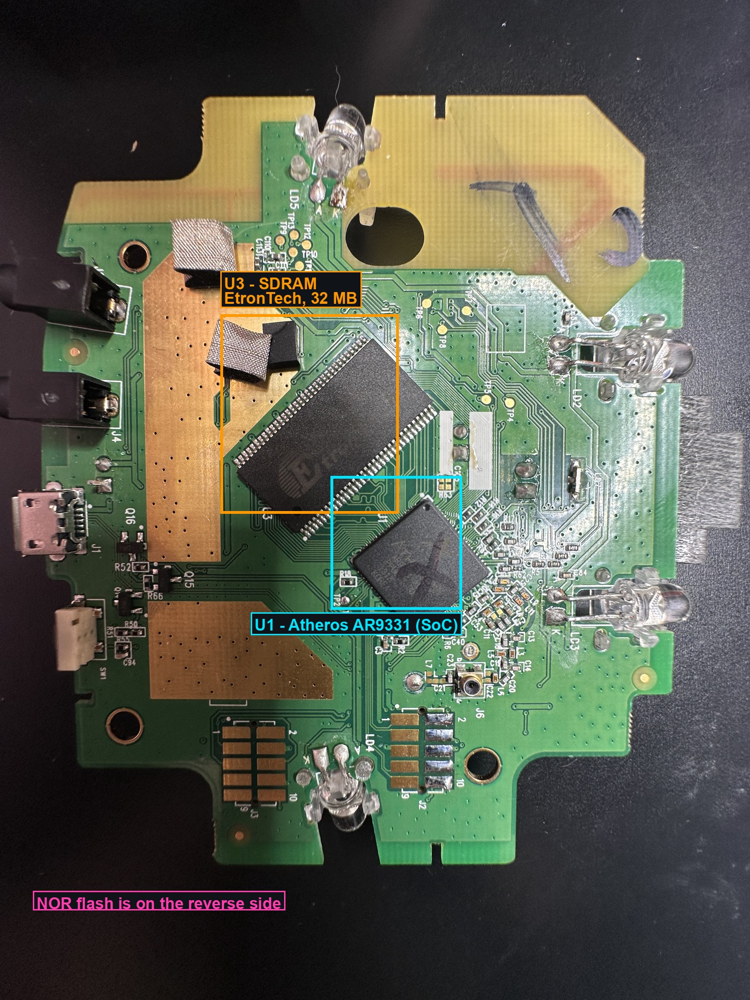
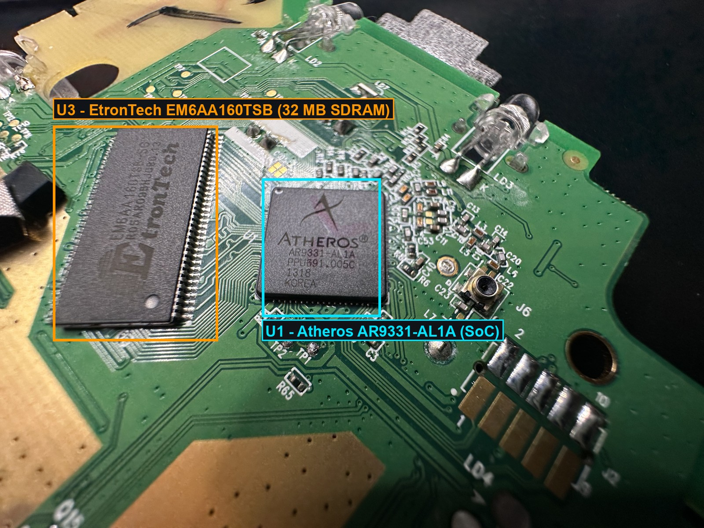
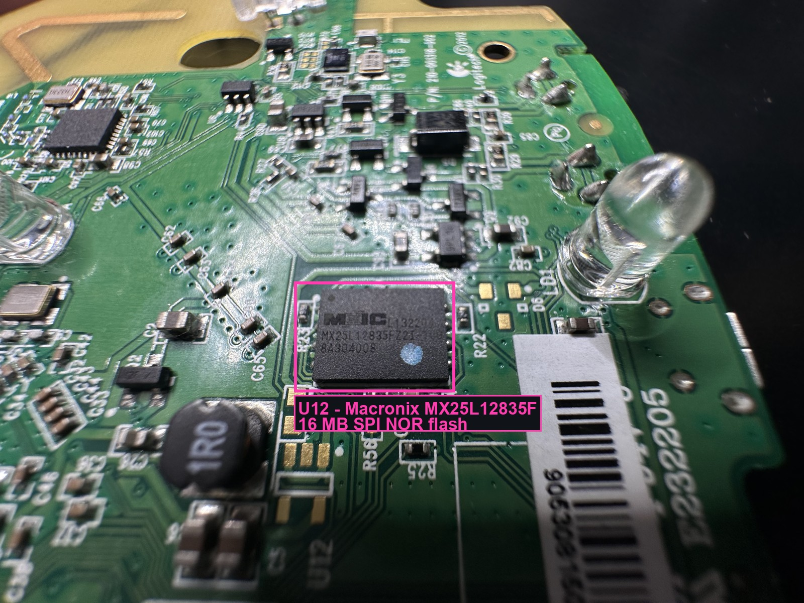

# Hardware & Firmware Specifications

All values observed directly from the U-Boot and Linux boot logs on 2026-06-21.
Source captures: [logs/verbose-boot-2026-06-21.log](logs/verbose-boot-2026-06-21.log),
[logs/first-boot-stockargs-2026-06-21.log](logs/first-boot-stockargs-2026-06-21.log).

## Platform
| Item | Value |
|------|-------|
| Product | Logitech Harmony Hub |
| Codename | **Pimento** (kernel image: "Pimento Kernel Image") |
| Board | AP121 (Atheros reference design) |
| SoC | Atheros **AR9331** "Hornet" |
| CPU core | MIPS 24Kc, revision `0x00019374` |
| Clock / perf | 266.24 BogoMIPS (lpj=532480) |
| I-cache | 64 kB, VIPT, 4-way, 32-byte line |
| D-cache | 32 kB, VIPT, 4-way, 32-byte line (cache aliases) |
| RAM | 32 MB (29788 kB available to kernel) |
| Flash | 16 MB NOR (`ar7240-nor0`, 256 sectors), id `0x100000ff` |

## Board & chip identification
The three main ICs, identified from the board (see [`images/`](images/)):

| Ref | Part | Role |
|-----|------|------|
| **U1** | Atheros **AR9331-AL1A** | SoC (MIPS 24Kc + Wi-Fi) |
| **U3** | EtronTech **EM6AA160TSB** | 32 MB SDRAM |
| **U12** | Macronix **MX25L12835F** | 16 MB SPI NOR flash |

Top side — SoC (U1) and SDRAM (U3); the NOR flash is on the reverse:

Reverse side — the Macronix NOR flash (U12):

## Firmware versions
| Component | Version |
|-----------|---------|
| U-Boot | 1.1.4-g4fe3722 (built 2013-06-18 11:15:30), "AP121 (ar9331) U-boot" |
| Linux kernel | 2.6.31-g89d565c, gcc 4.5.0, built **2020-02-04** 10:57:55 IST, `#1` |
| Build system | Poky (Yocto), builder `poky@use1efwbuild01` |
| init / userland | BusyBox **v1.13.4** (built 2017-09-26 16:03:52 IST) |
| Kernel image | lzma, 950876 B (928.6 kB), load `0x80002000`, entry `0x801cb980`, created 2020-02-04 05:29:56 UTC |

## Flash layout (mtdparts on `ar7240-nor0`)
From kernel cmdline `mtdparts=ar7240-nor0:...`

| # | Offset range | Size | Name | Notes |
|---|--------------|------|------|-------|
| 0 | `0x000000`–`0x010000` | 64 kB | `u-boot` | bootloader |
| 1 | `0x010000`–`0x100000` | 960 kB | `kernel` | primary kernel @ flash `0x9f010000` |
| 2 | `0x100000`–`0x1f0000` | 960 kB | `kernel2` | fallback kernel @ flash `0x9f100000` |
| 3 | `0x1f0000`–`0x5f0000` | 4096 kB | `root` | rootfs |
| 4 | `0x5f0000`–`0xaf0000` | 5120 kB | `data` | |
| 5 | `0xaf0000`–`0xff0000` | 5120 kB | `cache` | |
| 6 | `0xff0000`–`0x1000000` | 64 kB | `mfg` | manufacturing/cal data |

Flash base maps to `0x9f000000` (so partition 1 `0x010000` = `0x9f010000`).

## Free space & runtime storage (observed at the bare `init=/bin/sh` shell)
No `df` on the device, so flash-free is estimated from the erased-`0xFF` fraction
measured during the [backup](firmware-backup.md).

| Resource | Total | Free | Notes |
|----------|-------|------|-------|
| RAM | ~30 MB usable | **~25.8 MB** | `/tmp` is tmpfs in this RAM; much less once the full app runs |
| `/mnt/data` (overlay for `/`) | 5 MB (jffs2) | **~4 MB** | unionfs makes `/` writable; files here persist **without flashing** |
| `/cache` | 5 MB (jffs2) | **~5 MB** | basically empty, usable |
| `/` `/mnt/root` | 4 MB (squashfs) | 0 (read-only) | writes redirect to `/mnt/data` |

So ≈ **4 MB persistent (overlay) / ~9 MB if `/cache` is used / ~25 MB RAM** to work with.

## Userland tool inventory (matters for everything)
Present: BusyBox 1.13.4 applets + `/usr/bin/lua` (5.1), `wpa_supplicant`/`wpa_cli`,
`bluetoothd`/`hcitool`, `dbus`, `md5sum`, `vi`, `awk`, `sed`.
**Absent:** `dd`, `od`, `xxd`, `hexdump`, `base64`, `nc`, `tftp`, `wget`, `stty`,
`mtd_debug`/`nanddump`/`flashcp` (no mtd-utils), `gzip`, `python`, `perl`, `gcc`, `df`.
No Ethernet carrier in Linux (only `lo`). USB is **device/gadget mode** only
(`ath_udc` + `gadgetfs`; no `g_serial`/`g_ether` module). These gaps shaped the
[backup method](firmware-backup.md) and the [USB-gadget](usb-gadget-console.md) plan.

## Peripherals / drivers loaded
| Function | Detail |
|----------|--------|
| **IR** | **cc2544** transceiver, `chipid 0x4414` (kernel module `cc2544`) |
| WiFi | Atheros **AR9380** (`wifi0`), `ath_hal 0.9.17.1`, `ath_ahb 9.2.0_U10.5.13` (multi-bss), single chain (rx/tx chainmask = 1), mem `0xb8100000`, irq 2. Cal data restored from flash. |
| Bluetooth | HCI UART, **BCSP** protocol, Core ver 2.16, RFCOMM 1.11 |
| Ethernet/switch | `athrs_gmac` (ATHR_GMAC), Atheros **s26** switch (ATHRS26) |
| Audio | `ath_i2s` |
| USB | `ath_udc` gadget controller + `gadgetfs` (device/gadget mode, "USBDCP") |
| Accel/crypto | `asf` (Atheros, **Proprietary** license — taints kernel), `adf` |
| Input | `input: Pimento as /devices/virtual/input/input0` |
| Serial | 8250/16550, `ttyS0` @ MMIO `0xb8020000`, irq 19, 16550A |
| Filesystems | squashfs 4.0, unionfs 2.5.9.2, jffs2 2.2 |

## MAC / network identifiers observed
| Where | Value | Notes |
|-------|-------|-------|
| U-Boot eth0 | `00:03:7f:09:0b:ad` | Atheros OUI |
| U-Boot eth1 | `00:00:39:03:39:5e` | |
| GMAC unit 0 | `19:85:20:03:00:00` | looks uninitialized/placeholder |
| GMAC unit 1 | `00:0c:f0:60:dc:98` | |
| U-Boot env `ethaddr` | `00:aa:bb:cc:dd:ee` | default placeholder |
| Target AP (BSSID) | `92:90:2d:17:5d:0c` | AP the hub tried to join |
| Target SSID | `WH` | from `DES SSID SET=WH` |

## Boot-time anomalies (stock `init=/sbin/init`)
- `mount: mounting rootfs on / failed: No such file or directory`
- `mount: mounting tmpfs on /media/ram failed: No such file or directory`
- `Failed to connect to wpa_supplicant - wpa_ctrl_open: No such file or directory`
- `udhcpc ... Sending discover ... No lease, failing` (no DHCP server reachable on SSID `WH`)
- `####LOGI rewriting regs` — Logitech app runtime marker.
- The app runtime continuously emits an **HDLC/SLIP-framed binary stream** (bytes `0x7e`, `0xc0`, …) directly on `ttyS0`, interleaved with any console text. See [uart-console.md](uart-console.md#binary-pollution).
