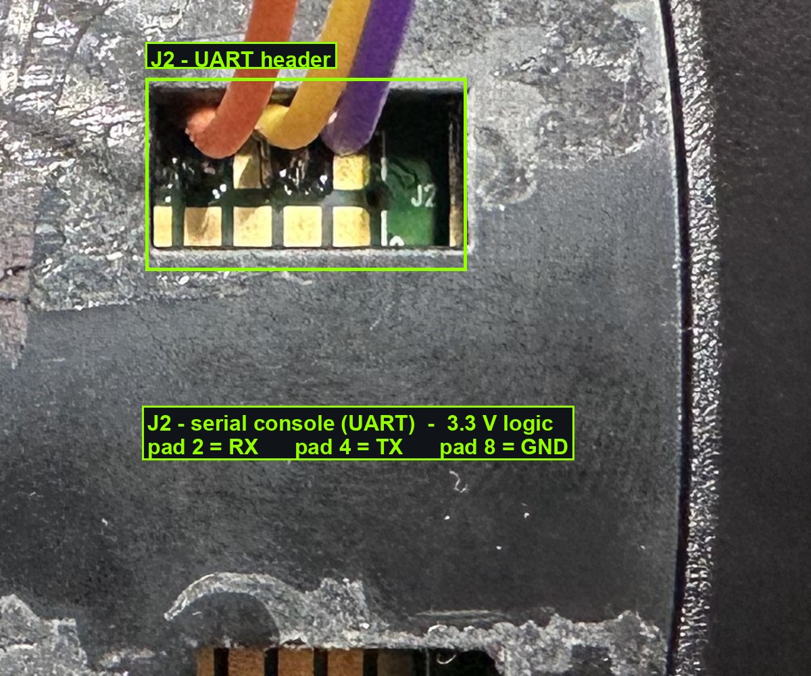

# UART Console Access

## Physical connection
- USB-TTL adapter (FTDI): enumerates as `/dev/cu.usbserial-A50285BI` on macOS.
- Settings: **115200 baud, 8N1**, no flow control.
- Always use the **`cu.*`** node, not `tty.*` — `tty.*` blocks on carrier-detect.
- Only one host process can usefully own the port. Keep `screen` closed while the
  logging daemon (below) is running.

### Where to connect — the J2 pads
On the board, the serial console is broken out on the **J2 pad cluster** (reachable through an
opening in the case underside — no full teardown needed):



| J2 pad | Signal |
|-------:|--------|
| **2**  | RX  (board input)  |
| **4**  | TX  (board output) |
| **8**  | GND |

Wire the USB-TTL adapter with the usual crossover and a common ground:

- adapter **GND** → J2 pad **8**
- adapter **TX**  → J2 pad **2** (board RX)
- adapter **RX**  → J2 pad **4** (board TX)

Use a **3.3 V** adapter — the AR9331 UART is 3.3 V logic. Do **not** connect a 5 V adapter or any
VCC pin; only RX/TX/GND are needed.

Reference manual command: `screen /dev/tty.usbserial-A50285BI 115200` (interactive,
but locks the port and loses scrollback — prefer the tooling below for automation).

## Tooling: `uartctl.py` (in repo root)
A persistent logger daemon owns the port, captures **every byte** to a tmp file
(flushed continuously, survives device power cycles since the USB adapter stays
enumerated), and accepts writes through a FIFO so logging is never interrupted.

```
python3 uartctl.py start              # start daemon (cu.* @ 115200)
python3 uartctl.py status             # pid, port, active log file
python3 uartctl.py send "ls -la"      # send a line + CR
python3 uartctl.py enter              # press Enter
python3 uartctl.py key ctrl-c         # named control keys
python3 uartctl.py sendraw '\x03'     # exact bytes
python3 uartctl.py spam '\r' 5        # flood a key for N s (interrupt autoboot)
python3 uartctl.py wait 'login:' 30   # block until regex appears in new output
python3 uartctl.py dump 8000          # print last N bytes of the log
python3 uartctl.py mark "note"        # write a marker line into the log
python3 uartctl.py stop
```

- Active log: `/tmp/uart-<YYYYMMDD-HHMMSS>.log`, plus stable symlink `/tmp/uart-latest.log`.
- Live tailing from another terminal is safe: `tail -f /tmp/uart-latest.log`.

### `catch_uboot.py` — interrupt autoboot
`bootdelay=0`, so the autoboot window is effectively instant. This helper floods
Enter, auto-detects U-Boot's countdown, stops, and reports whether it reached the
`ar7240>` prompt. Run it in the background, then power-cycle the device into it:

```
python3 catch_uboot.py 120 &     # floods for up to 120 s
# ... power-cycle the hub now ...
```

## Binary pollution {#binary-pollution}
Even with the kernel console enabled, the Harmony **app runtime writes its own
HDLC/SLIP-framed binary protocol directly onto `ttyS0`**, interleaved with text.
Telltale repeating bytes: `0x7e` (HDLC flag), `0xc0` (SLIP END), etc. — rendered as
`@A~…z` garbage. This is **not** a baud mismatch (U-Boot and the kernel console are
both 115200). To get a clean console, boot to a shell instead of the app
(`init=/bin/sh`) — see [boot-and-uboot.md](boot-and-uboot.md).

## Power cycles
The device is power-cycled **manually** (pull/replug power). The USB-TTL adapter is
USB-powered and stays enumerated across device power cycles, so the daemon keeps
capturing and reconnects automatically.

## Console baud is locked to 115200 {#baud-lock}
The kernel console only transmits at **115200** — full stop. Setting
`console=ttyS0,230400` or `,921600` in bootargs is accepted for the `init=` part, but
the serial driver still clocks data out at 115200, so pointing the host daemon at a
higher baud reads pure garbage (verified 2026-06-21: both 921600 and 230400 garbled;
115200 clean). The AR9331 UART clock also doesn't divide cleanly to 4×/8×. **Don't
chase a faster console** — the throughput ceiling is ~11.5 KB/s. (That ceiling is why
the [firmware backup](firmware-backup.md) RLE-compresses before sending.)

To catch U-Boot with `bootdelay=0`, flood Enter **continuously** —
`uartctl.py spam '\r' 90` in the background while power-cycling, plus
`uartctl.py wait 'ar7240>'`. `catch_uboot.py` stops ~0.6 s after the countdown, which
often misses the instant autoboot window.
